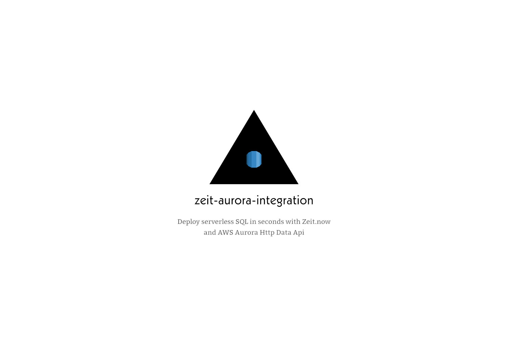

# Zeit now aurora integration

This is (https://zeit.co)[zeit.now] integration for (https://aws.amazon.com/rds/aurora/)[AWS Aurora] Data Http API. Create Serverless SQL in minutes

## How to use it

1. Add AWS Aurora - Serverless SQL integration. 
2. Setup with your AWS Account
3. Add new cluster
4. Link the cluster to the project

After that new env variables are added to your zeit project

### Env variables

```
AURORA_SECRET_ACCESS_KEY
AURORA_ACCESS_KEY_ID
AURORA_SECRET_ARN
AURORA_CLUSTER_NAME
AURORA_CLUSTER_ARN
AURORA_REGION
```

```ts
import micro from "micro";
import AWS from "aws-sdk";

export default micro(async (req, res) => {
  const rdsDataService = new AWS.RDSDataService({
    accessKeyId: process.env.AURORA_ACCESS_KEY_ID,
    region: process.env.AURORA_REGION,
    secretAccessKey: process.env.AURORA_SECRET_ACCESS_KEY
  });

  const params = {
    secretArn: process.env.AURORA_SECRET_ARN!,
    resourceArn: process.env.AURORA_CLUSTER_ARN!,
    sql: `CREATE DATABASE cats`
  };

  // const params = {
  //   secretArn: process.env.AURORA_SECRET_ARN!,
  //   resourceArn: process.env.AURORA_CLUSTER_ARN!,
  //   sql: `SELECT * from cats where id=:id`,
  //   parameters: [
  //     {
  //       name: "id",
  //       value: {
  //         longValue: 1
  //       }
  //     }
  //   ]
  // };

  let data = await rdsDataService.executeStatement(params).promise();

  return "done";
});

```

You can run this sample code in your zeit instance

## To be done

- [x] Setup with AWS keys
- [x] Add Aurora Cluster
- [x] Remove Aurora Cluster
- [x] Connect Aurora Cluster to project
- [x] Autogenerate cluster name
- [ ] Provide more examples
- [ ] Disconnect clusters from project
- [ ] Provide cluster with name and description
- [ ] Implement separate IAM Accounts for project runners